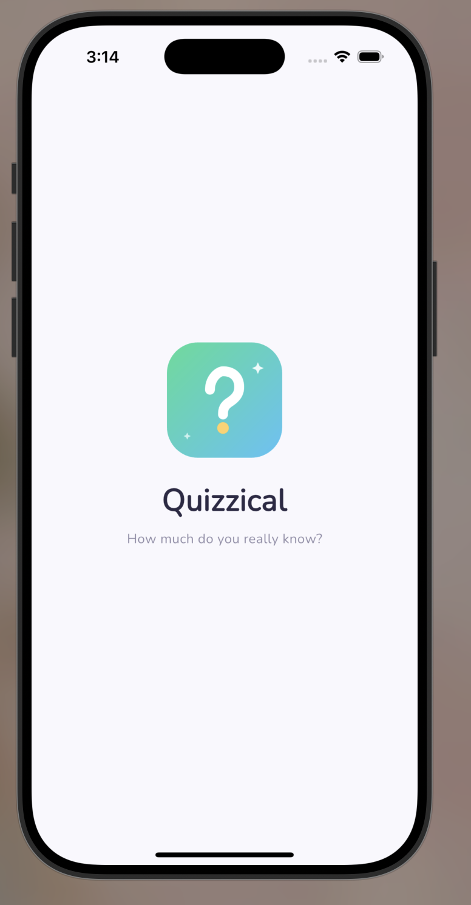
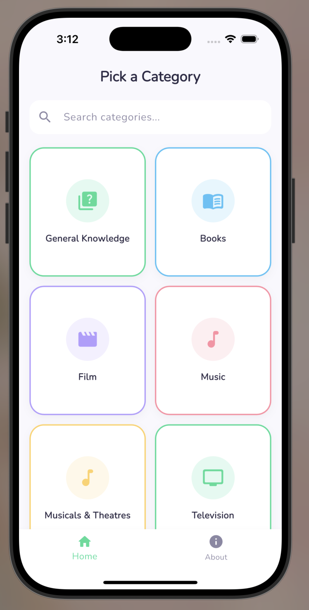
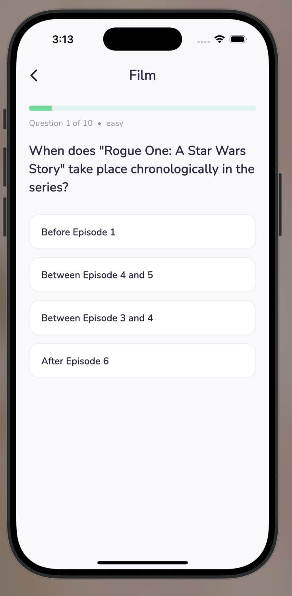
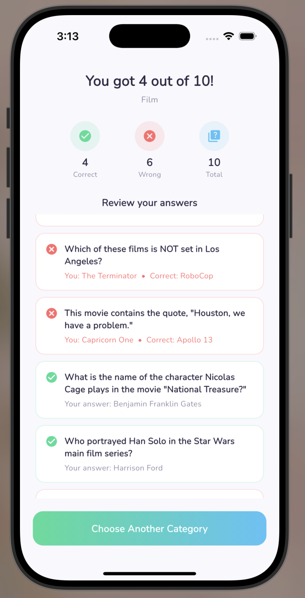
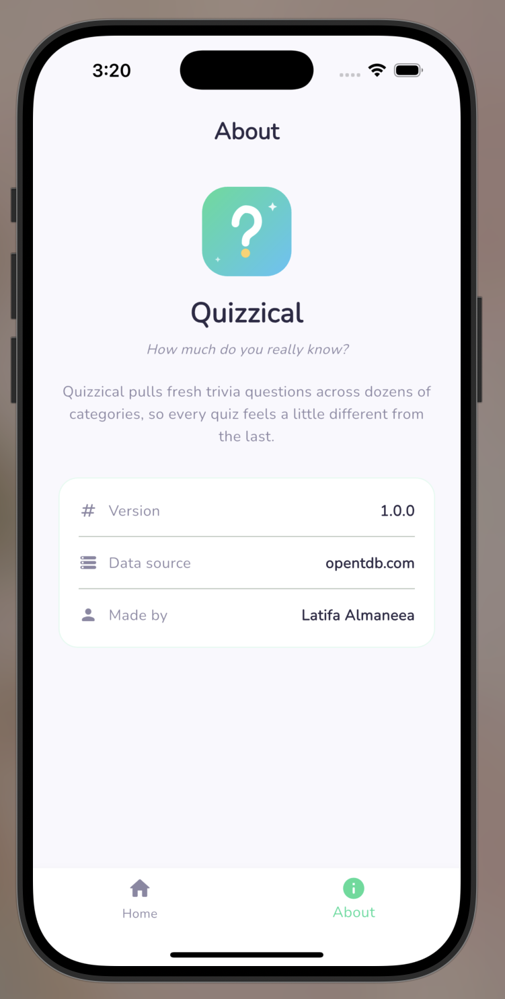

<div align="center">


# Quizzical

**A trivia quiz app built with Flutter — pick a category, answer 10 questions, and see how you did.**

Flutter Bootcamp · Project 2 · Working with Two Related APIs


</div>

---

## 📱 Overview

Quizzical pulls categories and questions from the [Open Trivia Database](https://opentdb.com/) and turns the classic "list → details" assignment pattern into something that actually feels like a mini-game: pick a category, answer 10 questions one at a time, then review exactly what you got right and wrong.

| | |
|---|---|
| **List screen (API 1)** | `opentdb.com/api_category.php` → all trivia categories |
| **Details screen (API 2)** | `opentdb.com/api.php?category={id}` → 10 questions for the chosen category |
| **Passed identifier** | `categoryId` — carried from the tapped category card into the quiz screen |

---

## 📸 Screenshots

<div align="center">

| Splash | Categories | Quiz | Results | About |
|:---:|:---:|:---:|:---:|:---:|
|  |  |  |  |  |

</div>
---

## ✨ Features

- 🏠 **5 screens** — Splash, Home (Categories), Quiz, Results, and About — wrapped in a bottom navigation bar
- 🔍 **Live search** — filter the category grid by name as you type
- 🎯 **Interactive quiz** — answer questions one at a time with instant visual feedback (correct/wrong highlighting)
- 📊 **Results with review** — animated score, correct/wrong/total stat chips, and a full scrollable review of every question you answered
- 🎉 **Confetti celebration** on the results screen
- 🌀 **Custom splash animation** — the logo spins and scales in on launch
- 🎨 **Custom app icon & logo** — designed to match the app's color palette
- 🧭 **Graceful error handling** — loading, empty, and error states (with retry) on both API calls, not just the happy path

---

## 🛠️ Tech Stack

| Package | Purpose |
|---|---|
| [`http`](https://pub.dev/packages/http) | Networking — fetching categories and questions |
| [`html_unescape`](https://pub.dev/packages/html_unescape) | Decoding HTML entities in trivia text (e.g. `&quot;` → `"`) |
| [`google_fonts`](https://pub.dev/packages/google_fonts) | Custom typography (Nunito) |
| [`confetti`](https://pub.dev/packages/confetti) | Celebration animation on the results screen |
| [`flutter_launcher_icons`](https://pub.dev/packages/flutter_launcher_icons) | Generating the app icon from a single source image |

---

## 📂 Project Structure

```
lib/
├── main.dart                    # App entry point, theme setup
├── const/
│   └── app_colors.dart          # Centralized color palette
├── models/
│   ├── category_model.dart      # Model for API 1 (categories)
│   └── question_model.dart      # Model for API 2 (questions) + AnsweredQuestion
├── services/
│   └── api.dart                 # TriviaApiService — both API calls
├── widgets/
│   └── category_card.dart       # Reusable category grid card
└── screens/
    ├── splash_screen.dart       # Screen 1 — animated intro
    ├── main_navigation.dart     # Bottom nav shell (Home + About)
    ├── categories_screen.dart   # Screen 2 — list from API 1, with search
    ├── quiz_screen.dart         # Screen 3 — details from API 2, interactive
    ├── result_screen.dart       # Screen 4 — score + answer review
    └── about_screen.dart        # Screen 5 — app info
```

---

## 🚀 Getting Started

1. **Clone or unzip the project**, then install dependencies:
   ```bash
   flutter pub get
   ```

2. **Run the app:**
   ```bash
   flutter run
   ```

3. *(Optional)* Regenerate the app icon if you swap the logo image:
   ```bash
   flutter pub run flutter_launcher_icons
   ```

No API keys or environment setup needed — the Open Trivia DB is fully public.

---

## 🧩 How the Data Flows

1. `CategoriesScreen` calls `TriviaApiService.fetchCategories()` inside `initState()`, storing the `Future` for a `FutureBuilder` to watch.
2. Tapping a category card navigates to `QuizScreen`, passing along that category's `id` and `name`.
3. `QuizScreen` uses the received `categoryId` to call `TriviaApiService.fetchQuestions(categoryId)` — this is the "identifier passed from list to details" the assignment asks for.
4. As the user answers, each question is logged into a running `List<AnsweredQuestion>`.
5. On the last question, `ResultScreen` receives the final score *and* the full answer log — no extra API calls needed to build the review list.
6. Tapping "Choose Another Category" returns to `MainNavigation` (not a bare screen), so the bottom nav bar is always present outside of an active quiz.

---

## 🌟 Extra Credit

- **Bottom navigation bar** with a dedicated About screen (beyond the 4-screen minimum)
- **Live search filtering** on the categories grid
- **Full answer review list** on the results screen — not just a final score, but exactly which questions were right/wrong and what the correct answer was
- **Custom-designed app icon and logo**, matching the app's color system
- **Custom splash screen animation** (spin + scale entrance)
- **Consistent design system** — a single `AppColors` source of truth used across every screen, plus a rotating pastel palette for category cards
- **Robust API handling** — distinct loading, error (with retry), and empty states on both the categories and quiz screens, including a dedicated "no results" state for the search bar

---

## 👤 Author

**Latifa Almaneea**
Flutter Bootcamp — Project 2
